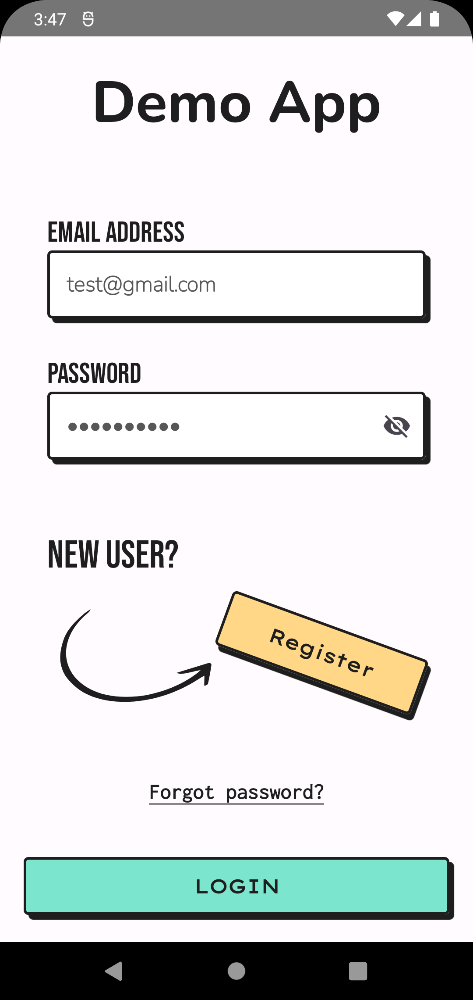
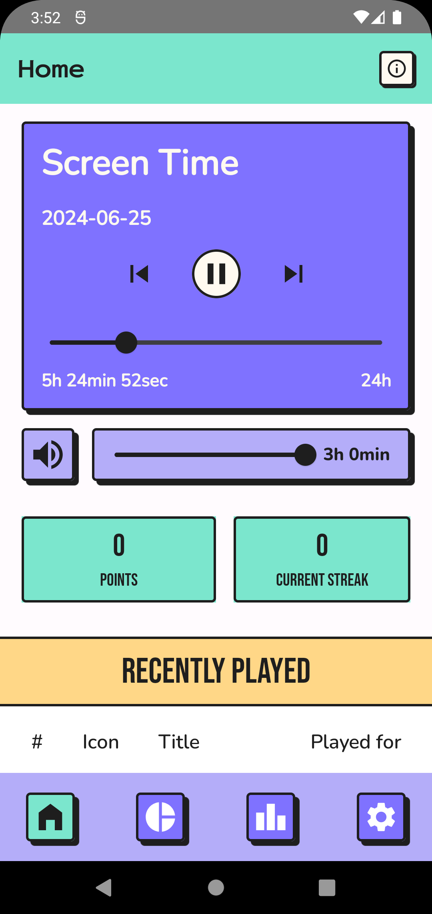
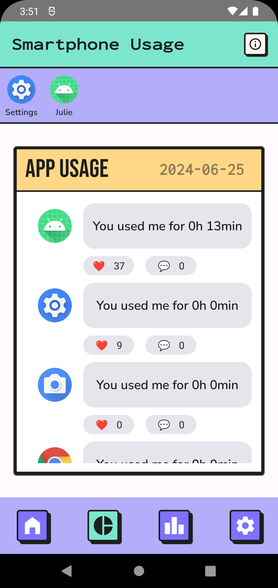

# Thesis Project
An Android application designed to enhance digital well-being through a humanistic approach to data visualization.

## Screenshots

## Featuring
- JetPack
  - Compose
  - Navigation Component
  - Hilt
  - Preferences Datastore
  - Room
  - Work Manager
- Arrow
- Firebase
  - Authentication
  - Firestore

## Requirements
Android Snow Cone (API level 31) or later

## Project setup
You need to configure a [Firebase project](https://firebase.google.com/docs/android/setup)

## Author
[Luca Samorè](https://github.com/LucaSamore)
